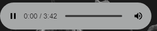

#  DrumKit  #

##  **實現目標**  ##

使用者在鍵盤上按下ASDFGHJKL鍵時，使對應的音效響起且高亮畫面。
##  **Demo**  ##

##  **相關屬性**     ##

**Html**

- data-*
- preload

**Key事件**

- keydown
- keyup

**Audio屬性與事件**

- play()
- paused()
- load()
- currentTime
- timeupdate
- buffer
- readyState

# 過程中我遇到的困難 #
----------

**play()是一個不同步的method，它會返回Promise，音檔成功播放是Promise實現的條件。**

## 不懂audio與play()背後的運作邏輯 : ##

    <audio data-key="65" preload="metadata" controls src="sounds/LOVE.mp3"></audio>
    //告訴瀏覽器預先加載音檔元數據
    

    window.addEventListener("keydown", e => {

    const audio2 = document.querySelector(`audio[data-key="${e.keyCode}"]`);
    
    console.log(audio2.paused);//true //播放器是暫停的狀態
    console.log(audio2.currentTime); //0s 
    let play = audio2.play(); //播放器請求加載data //這行打上斷點，有跑1.2秒數
    console.log(play); //Promise {<pending>}進行中
    console.log(audio2.paused); //false //播放器不是暫停的狀態
    
    play.then(() => {  //onfulfilled() //播放器請求成功，音檔可以開始播放
     console.log(play); //Promise {<resolved>: undefined} //已實現
     console.log(audio2.paused); //false
     console.log(audio2.currentTime); //0s  
    
    }); //這行執行完畢後從1.2s開始播放音檔
    .
    .
    .

    });

在**斷點執行到let play = audio2.play()時，它會播放約1.2s的聲音後停止**。

**但播放器其實還沒有開始播放，還是在0秒與pause的狀態**。

**而是等到play() Promise實現，異步執行onfulfilled()後才開始轉變成播放的狀態**。

**即使是播放狀態，audio2.currentTime印出來還是只有0秒**。

而等**onfulfilled()執行完畢後播放器會直接跳到1.2s後開始播放**。

    <audio data-key="65" preload="metadata" controls src="sounds/LOVE.mp3"></audio>
    //告訴瀏覽器預先加載音檔元數據
    

    window.addEventListener("keydown", e => {

    const audio2 = document.querySelector(`audio[data-key="${e.keyCode}"]`);
    
    console.log(audio2.paused);//true //播放器音檔是暫停的狀態
    console.log(audio2.currentTime);//0s 
    audio2.currentTime=0; //播放器當下時間改為0s
    let play = audio2.play(); //播放器請求加載data //這行打上斷點，有跑1.2秒數
    console.log(play); //Promise {<pending>}進行中
    console.log(audio2.paused); //false //播放器不是暫停的狀態
    
    play.then(() => {//onfulfilled()  //播放器請求成功，音檔可以開始播放
     console.log(play); //Promise {<resolved>: undefined}//已實現
     console.log(audio2.paused); //false    
     console.log(audio2.currentTime});//1.281066s    
    
    });
    .
    .
    .
    });

**我在執行let play = audio2.play()前加上了audio2.currentTime = 0**。

在**斷點執行到let play = audio2.play()時，它也會播放約1.2s的聲音後停止**。

**但播放器還沒有開始播放，還是在0秒與pause的狀態**。

**也是一樣直到play() Promise實現，異步執行onfulfilled()後才會轉變成開始播放的狀態**。

不過這次**onfulfilled()的audio2.currentTime有印出1.2的秒數**，而**剩下的秒數也是在onfulfilled()執行完畢後才會繼續播放**。

**前後兩例子造成差異的原因就是多加的這段程式碼:**

    audio2.currentTime=0; //播放器當下時間改為0s

**但是這兩例子的currentTime本來就是0s的狀態，所以我不知道背後是什麼原因造成這個現象。**

    audio2.play(); 
    audio2.pause();
    
再來另外寫了一個例子，想測試**這種情形的play()執行後會怎麼運作**。

**最後它會直接拋出The play() request was interrupted by a call to pause().**
並且**完全無法播放音檔**。

## 解決方法 : ##

在MDN找到了可以解決的辦法，**使用audio的屬性和事件們，操作audio的屬性與事件來監控audio從網頁開始載入再到觸發keydown事件後的整個過程**，透過監控可以比較了解audio背後的運作，再去撰寫程式碼可以減少拋出錯誤的機率。

不過**這個方法的缺點是觸發的事件不是當下執行**，所以**我還是沒辦法準確知道當下的程式碼背後發生了什麼事，還是得需要去用猜測的**。

我找到三篇文章，看了會對audio這方面的知識有一些概念:

[http://www.csie.ntnu.edu.tw/~u91029/Audio.html](http://www.csie.ntnu.edu.tw/~u91029/Audio.html "http://www.csie.ntnu.edu.tw/~u91029/Audio.html")

[https://www.chromium.org/developers/design-documents/video](https://www.chromium.org/developers/design-documents/video "https://www.chromium.org/developers/design-documents/video")

[https://zhuanlan.zhihu.com/p/39283738](https://zhuanlan.zhihu.com/p/39283738 "https://zhuanlan.zhihu.com/p/39283738")

這題我的挫折都來自於延伸思考的部分，程式碼不同的搭配都會超乎我的預期之外 ; 我還有很多不解的地方，等我日後技術能力提高了再回來研究它。
### 參考 ###
Wes Bos :[https://javascript30.com/](https://javascript30.com/) Day1
