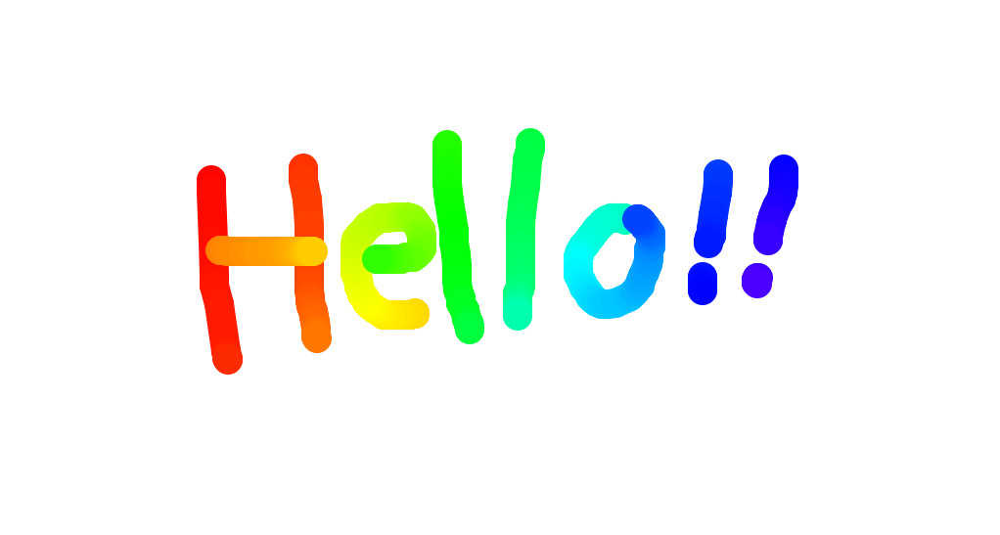
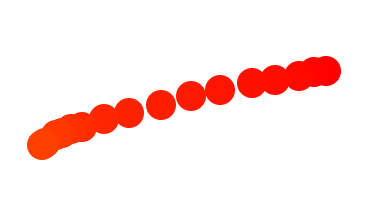
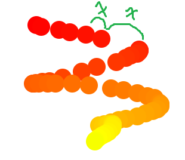
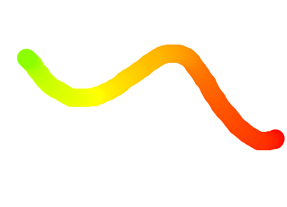

#  Fun With Canvas  #

##  **實現目標**  ##

使滑鼠有繪圖功能。

##  **Demo**  ##

[DEMO](https://doggyun.github.io/Fun_With_Canvas/Fun_With_Canvas.html)

##  **canvas**     ##

**相關屬性**

- getContext()
- strokeStyle
- lineCap
- lineJoin

**路徑繪製**

- beginPath()
- moveTo()
- lineTo()

**鼠標事件**

- mousedown
- mousemove
- mouseup
- mouseleave

# 過程中我遇到的困難 #

我先嘗試了下面這一種線條畫法來進行實驗。

## 繪製線條 : 將線條的路徑起點與終點都設為同一點滑鼠座標。 ## 

    canvas.addEventListener('mousemove', e2 => { //滑鼠移動事件

    context.lineCap = 'round'; //線帽為圓形
    context.beginPath(); //繪製一個全新的路徑
    context.moveTo(e2.offsetX, e2.offsetY); //滑鼠座標作為路徑起點
    context.lineTo(e2.offsetX, e2.offsetY); //同樣滑鼠座標作為路徑終點
    context.stroke(); //繪製線條
    
    };

- **路徑起點與終點都設為同一點座標會造成在同一點座標上的重複繪製。**

- 在**滑鼠拖曳速度加快**的情況下**我繪製出來的線條會產生斷點**，反之**滑鼠拖曳速度放慢**的情況下，**線條有連續性**，才是我要的效果。

斷點不是我要的，而從這裡就可以推斷出**造成點的原因是座標重複繪製**。

那**滑鼠拖曳的速度為什麼會影響點的連續性 ?**

## mousemove事件是怎麼被觸發的 ?  ##

在要知道滑鼠速度與斷點的關係之前，首先我想知道**mousemove事件是怎麼被觸發的 ?**

**使用者用滑鼠在canvas畫布上移動時mousemove事件就會被連續觸發，但是它是以什麼頻率被觸發一次?**

在w3c上查到的如下

> Each time a user moves the mouse one pixel, a mousemove event occurs

**只要滑鼠移動1pixel的座標 , mousemove事件就會被觸發一次。**

所以**照理說不管滑鼠拖曳速度的快慢，點都會保持著連續性，不會有斷點產生**。

但是前面已經證明了這是錯的。

目前這裡我推斷 : 

- **1pixel其實只是mousemove事件被觸發的最小座標單位**。
- **滑鼠拖曳的速度會影響mousemove事件的觸發，但原因不清楚**。

## 瀏覽器、滑鼠、作業系統的工作方式 : ##

**滑鼠拖曳的速度為什麼會影響mousemove事件的觸發 ?**

我查到的可能的答案是 :**這與瀏覽器、滑鼠、作業系統的工作方式有關。**

(註:我跟它們不熟，所以只能拼湊出個大概。)

**瀏覽器不會因為鼠標碰觸到每個pixel而觸發事件**，而是**在經過瀏覽器定義的每X毫秒**之後，**檢查鼠標現在的位置跟上次被觸發的位置是否相同**，不同的話則觸發mousemove事件。

所以**mousemove事件的觸發是瀏覽器內部的時間機制決定的，而不是由pixel來決定**。

**以下可能是它們的分工方式，然後互相影響mousemove事件被觸發的頻率:**

- **滑鼠每秒向作業系統報告其位置約100~150次，高級的滑鼠它的位置會更新的更精準**。

- **瀏覽器以一定的時間間隔從作業系統接收滑鼠位置，並在這些位置觸發mousemove事件**。

- **電腦的記憶體與CPU可能會影響瀏覽器每X毫秒觸發多少個mousemove事件或是X毫秒時間上的縮減，目的是減少耗用系統資源，不致於拖慢網頁效能**。

## 解決方法 : ##

    
    
    let isDrawing = false;
    let startPoint = {
            x: 0,
            y: 0
        };

    canvas.addEventListener('mousedown', e1 => { //滑鼠點擊事件
    isDrawing = true;       
    startPoint = { 
        x: e1.offsetX, //滑鼠點擊的座標
        y: e1.offsetY 
    };

    });

    canvas.addEventListener('mousemove', e2 => { //滑鼠移動事件

    context.lineCap = 'round'; //線帽為圓形
    context.beginPath(); //繪製一個全新的路徑
    context.moveTo(startPoint.x, startPoint.y); //滑鼠點擊的座標作為路徑起點
    context.lineTo(e2.offsetX, e2.offsetY); //滑鼠座標作為路徑終點
    context.stroke(); //繪製線條
    startPoint = { //將這次路徑終點座標設定為下一次的路徑起點座標
        x: e2.offsetX,
        y: e2.offsetY
    };
    
    };

我將原本的**context.moveTo(e2.offsetX, e2.offsetY)改為context.moveTo(startPoint.x, startPoint.y)**。

**並且最後再將startPoint重新賦值一個新物件**。

(startPoint.x, startPoint.y)是mousedown事件的滑鼠點擊座標，**這樣子繪製的線條就是以線段組成連續性，而不是之前的以點組成連續性**，因為不是以點為最小面積組成，就算在畫的過程中，**mousemove又沒被觸發，也不會被影響，因為只要有觸發到的座標一定會直接連成一條線**。

### 參考 ###
Wes Bos :[https://javascript30.com/](https://javascript30.com/) Day8
