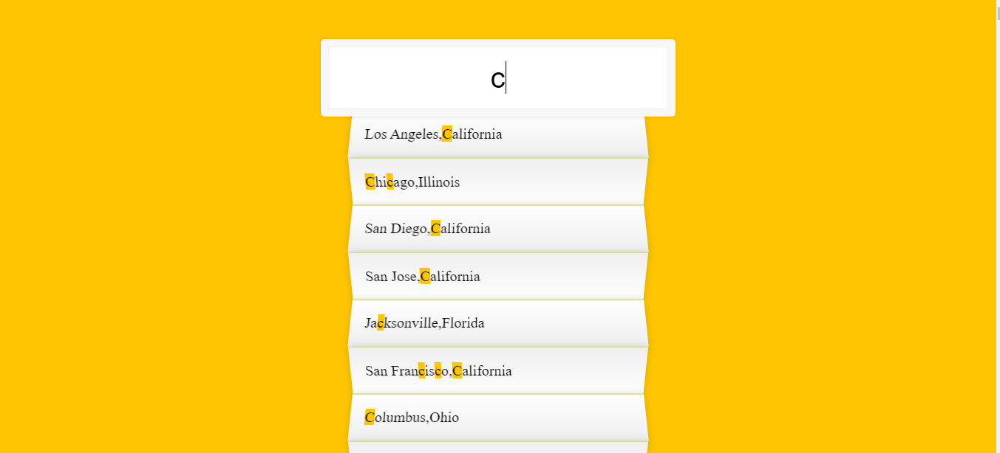

#  TypeAhead  #

##  **實現目標**  ##

使用者在輸入框中輸入英文字母，找出符合字母的美國city資料，並且把資料的英文字母標識起來。
##  **Demo**  ##

## **相關屬性** ##

**Promise**

- fetch()
- then()
- json()

**Array**

- filter()
- map()
- push()
- join()

**RegExp**

- match()
- replace()

# 過程中我遇到的困難 #

----------
我一開始沒有Promise的基礎，所以在寫fetch()的部分就卡了好幾天;我將Promise曾經卡住過我的問題列了下來:

       let p1 = new Promise((resolve,reject)=>{
       setTimeout(()=>{resolve(1);},1000));
       p1.then(function(){...});
       ....       

- then()是不同步的還是then()中的onFulfilled是不同步 ? 

- onFulfilled為什麼被設計成不同步 ? 且放在MicoTask裡 ? 

- onFulfilled任務為什麼會優先執行於其他MacroTask中的不同步任務 ? 

- MacroTask與MicoTask之間的差異還有兩者被區分開來是要解決什麼問題 ?

 

 
### 參考 ###
Wes Bos :[https://javascript30.com/](https://javascript30.com/) Day6

   
