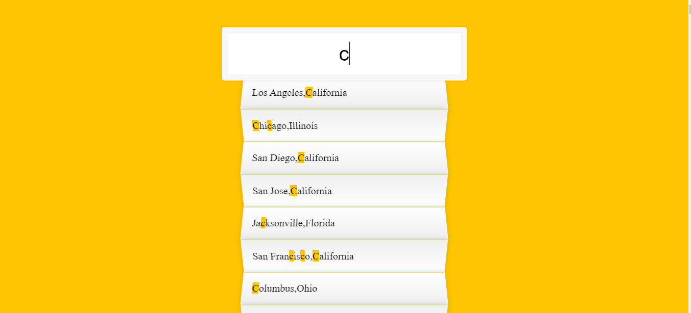

#  Vue_TypeAhead   #

##  **實現目標**  ##

使用者在輸入框中輸入英文字母，找出符合字母的美國城市資料，並且把資料的英文字母標識起來。
##  **Demo**  ##

##  **相關屬性**     ##

**V屬性**

- v-html
- v-if
- v-for
- v-model

**property**

- 生命週期
- computed
- methods

# 過程中我遇到的困難 #

----------
這是Vue.js寫的Type Ahead。

## 實作生命週期時遇到的問題 :

我在beforeCreate階段時設置了console.log(this)，目的是為了**想印出不同生命階段的各個Vue實體的當下值**。

不過印出來後覺得奇怪的是**console.log(this)展開後的$data與console.log(this.$data)的結果卻不相同**:

    
    beforeCreate: function() {
    console.log("實體初始化，$el屬性還未被建立與初始化");  
    console.log(this);//展開vue實體，$data:Object
    console.log(this.$data); //undefined  
    }, 
    created: function() {
    //do something
    },

## 解決方法: ##

上網搜尋後這個似乎是個bug(有看到另個說法是傳址)。

**在執行完整個網頁的時候，最後的程式碼變更了this的屬性值，而當下this展開看到的會是已經被變更過的最新狀態(未來值)而不是現在值。**

所以不管在哪個生命階段，**console.log or dir (this)都是印出mounted階段的Vue實體**，那如果要看當下的值就在該生命週期上打斷點。

### 參考 ###
Alax宅幹嘛 :[https://www.youtube.com/watch?v=_TbG2iuN9kM&t=1000s](https://www.youtube.com/watch?v=_TbG2iuN9kM&t=1000s) 