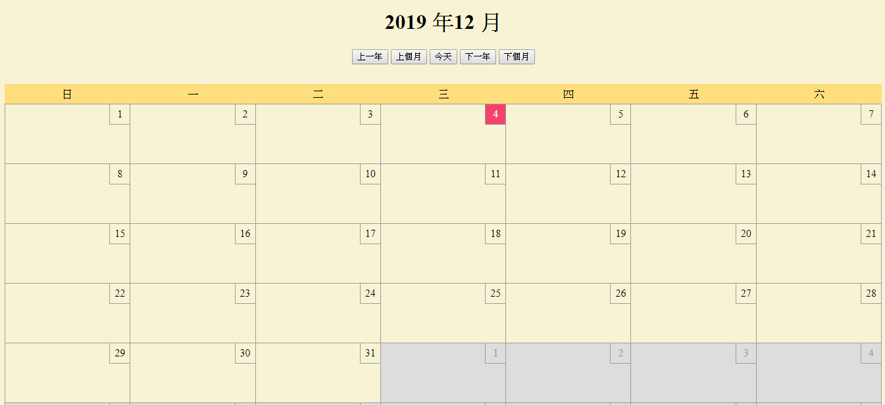

#  Vue_萬年曆  #

##  **實現目標**  ##

用Vue寫出一個擁有可前後調整年月功能的萬年曆。
##  **Demo**  ##

[DOMO](https://doggyun.github.io/Vue_%E8%90%AC%E5%B9%B4%E6%9B%86/Vue_%E8%90%AC%E5%B9%B4%E6%9B%86.html) 

##  **相關屬性**     ##

**V屬性**

- v-on
- v-for
- v-bind

**property**

- computed
- methods

**method**

- Date() 

# 過程中我遇到的困難 #
----------
萬年曆的每個月份被設計成**7(天) * 6(禮拜) = 42(天)**，而在計算出這42天的號碼之前，**我必須先計算出每個月份的第1天的號碼**。

## 計算每個月份的第一個禮拜的星期日號碼 : ##

範例: **今天 2019/11/19 星期二**

**公式:(19-2)%7=3, 3-7=-4,**

    let getDate = (this.calendar.date - this.calendar.day) % 7 - 7;  

**再使用Date()把-4換算成11月第一個禮拜的星期日號碼**。

sundayDate(**Sun Oct 27 2019 00:00:00 GMT+0800** ) = new Date(2019,10,-4)。

    let sundayDate = new Date(this.calendar.year, this.calendar.month, getDate); 

我設計這個公式的想法是:

- **(今天號碼19 - 今天星期號碼2) = 這個禮拜的星期日的號碼17。**

- **(這個禮拜的星期日的號碼17) / 7天分配 = 第1個禮拜只有分配到3天，且這3天是2019/11/1號&2號&3號;其餘兩個禮拜配滿14天。**

- **(第1個禮拜只有分配到3天) - 7天 = 第1個禮拜有4天沒有分配到號碼。**

- **Date()會把-4自動往前調整日期，變成2019/10/27 星期日。**

我是拿電腦的月曆當作參考範本，目標是 :

- **計算出第一天的號碼後再使用迴圈算出其餘41天的號碼**。
- **設計出來的公式被套用計算後必須是符合參考月曆的曆法排序**。

## 公式成功與失敗的條件 : ##

    let getDate = (this.calendar.date - this.calendar.day) % 7 - 7;  

**這個公式被套用在某些不同月份、不同日期上就失敗了，因為它們被計算後不符合參考月曆的曆法排序**。

例如:2019/12/07 星期六

- **12月要計算的第一天在電腦上的排序是2019/12/01 星期日(正確)**

- **而我計算出來的12月的排序是2019/11/24 星期日(不正確)**

**公式會成功的條件 :**

    
    範例: 2019/11/19 星期二
         2020/02/13 星期四

    (今天號碼19 - 今天星期號碼2)%7!==0 && (今天號碼位置是坐落在第二~第六個禮拜);

**公式會失敗的條件 :**
    
    範例: 2020/06/20 星期六
    
    (今天號碼20 - 今天星期號碼6)%7==0 
    
    範例: 2019/12/03 星期二

    (今天號碼位置是坐落在第一個禮拜);
  
## 解決方法: ##

**這個公式因為忽略到參考月曆的每個月份的排版不同**，所以**不能以從固定的月份設計出的公式再套用到不同月份上**。

**要找出參考月曆上，每個月份的共同號碼與規則**。

我找出**每個月份的1號 :** 

- **1號是每個月份的開頭**。
- **每個月份只有1號的位置範圍在第一個禮拜內，其他號碼的位置範圍則在兩個禮拜以內**。
- **選擇其他號碼要考慮到每個月份、同個號碼,但位置範圍不同的問題,設計出來的公式會被複雜化**。

## 新公式: ##

**求每個月份1號的時間物件 :**

   範例: **2019/11/19 星期二**

**時間物件(Fri Nov 01 2019 00:00:00 GMT+0800 ) = new Date(2019,10,1) ;** 
 
    let oneDate = new Date(this.calendar.year,this.calendar.month, 1);
 
**1號 - (時間物件.getDay()) = 1-5 = -4**

    1 - (oneDate.getDay());

**再使用Date()將-4自動往前調整日期，得到2019/10/27 星期日。**

    let sundayDate = new Date(this.calendar.year, this.calendar.month, 1 - oneDate.getDay());

**使用這個公式後解決了我計算出來的42天排版不符合參考月曆的排版的問題**。

### 參考 ###
Alax宅幹嘛 :[https://www.youtube.com/watch?v=0NoClrHms-Y&t=15s](https://www.youtube.com/watch?v=0NoClrHms-Y&t=15s) 
