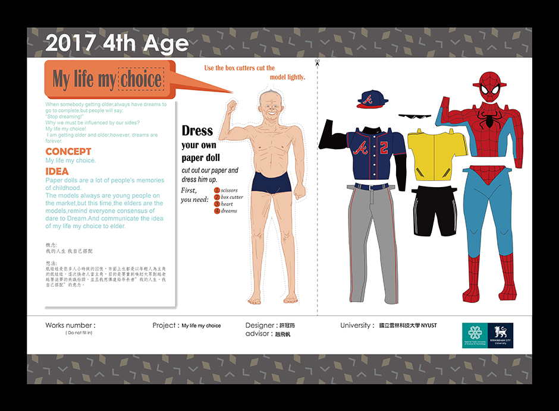

## 我的人生，我自己搭配。 ##

系列作品。

**工具**: Adobe illustrator

**概念**:運用紙娃娃穿搭的概念，喚醒大眾對越老越要追夢的議題，並且想傳達給年長者，儘管年紀大了，自己的人生必定可以自己選擇。

[我的人生，我自己搭配_01](https://github.com/Doggyun/doggyun.github.io/blob/master/%E8%A8%AD%E8%A8%88/%E5%B9%B3%E9%9D%A2%E8%A8%AD%E8%A8%88/%E6%88%91%E7%9A%84%E4%BA%BA%E7%94%9F%EF%BC%8C%E6%88%91%E8%87%AA%E5%B7%B1%E6%90%AD%E9%85%8D_01.jpg)

[我的人生，我自己搭配_02](https://github.com/Doggyun/doggyun.github.io/blob/master/%E8%A8%AD%E8%A8%88/%E5%B9%B3%E9%9D%A2%E8%A8%AD%E8%A8%88/%E6%88%91%E7%9A%84%E4%BA%BA%E7%94%9F%EF%BC%8C%E6%88%91%E8%87%AA%E5%B7%B1%E6%90%AD%E9%85%8D_02.jpg)

[我的人生，我自己搭配_03](https://github.com/Doggyun/doggyun.github.io/blob/master/%E8%A8%AD%E8%A8%88/%E5%B9%B3%E9%9D%A2%E8%A8%AD%E8%A8%88/%E6%88%91%E7%9A%84%E4%BA%BA%E7%94%9F%EF%BC%8C%E6%88%91%E8%87%AA%E5%B7%B1%E6%90%AD%E9%85%8D_03.jpg)

##  鏡。 ##

系列作品。

**工具**: Adobe photoshop

**概念**:只有一半的蝴蝶讓人聯想到破碎與死亡的氣息，牠代表了我們面對於生命旅程的悲觀與絕望。

我要傳達的是我們不必一直沉浸在悲傷之中無可自拔，**失敗的反面是成功**，就像這半隻蝴蝶一樣，在鏡子的映照下，從其反面找到了遺失的自己，最終完成了蝴蝶的美麗與生機。

[鏡_01&02](https://github.com/Doggyun/doggyun.github.io/blob/master/%E8%A8%AD%E8%A8%88/%E5%B9%B3%E9%9D%A2%E8%A8%AD%E8%A8%88/%E9%8F%A1.jpg)

## 階級複製。 ##

**工具**: Adobe photoshop

**概念**:用印章可複製的特性與姓氏來表達階級複製的社會現象。

蓋印章代表家族世世代代的複製，最後用字型的變化作為富人與窮人的對比。

[階級複製](https://github.com/Doggyun/doggyun.github.io/blob/master/%E8%A8%AD%E8%A8%88/%E5%B9%B3%E9%9D%A2%E8%A8%AD%E8%A8%88/%E9%9A%8E%E7%B4%9A%E8%A4%87%E8%A3%BD.jpg)
