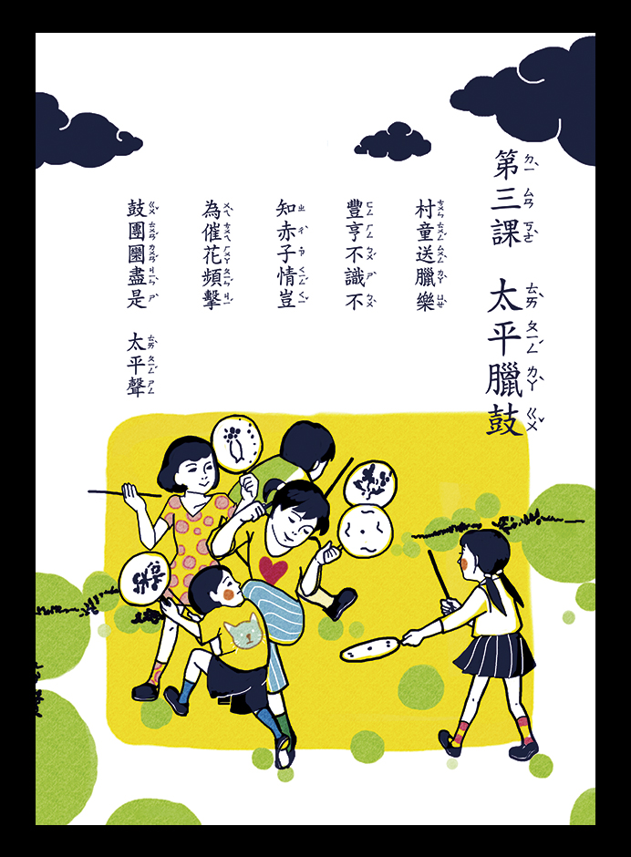
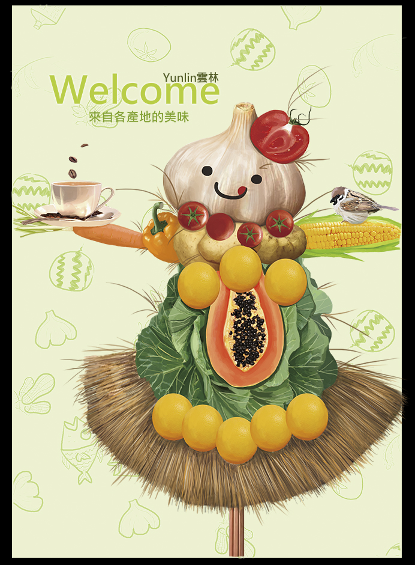
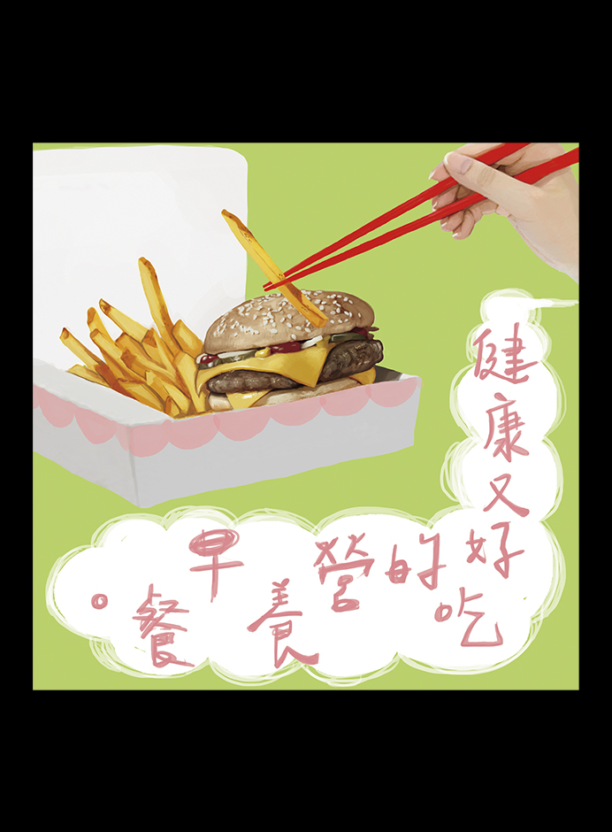

## 太平臘鼓。 ##

**工具**: Adobe photoshop

**概念**: 懷舊作品。還記得我國小時的國語課本，內容是手繪的插畫風格，以現在的眼光來看，它充滿了的小時候的回憶，因此創作出了這個作品。

[太平臘鼓](https://github.com/Doggyun/doggyun.github.io/blob/gh-pages/%E8%A8%AD%E8%A8%88/%E6%8F%92%E7%95%AB/%E5%A4%AA%E5%B9%B3%E8%87%98%E9%BC%93.jpg) 

## 歡迎光臨雲林。 ##

**工具**: Adobe photoshop

**概念**: 雲林有著農業首都的美名，我將雲林盛產的蔬菜與水果組合成一個富有生命的稻草人，彷彿向各位說著歡迎你們來到雲林。

[歡迎光臨雲林](https://github.com/Doggyun/doggyun.github.io/blob/master/%E8%A8%AD%E8%A8%88/%E6%8F%92%E7%95%AB/%E6%AD%A1%E8%BF%8E%E5%85%89%E8%87%A8%E9%9B%B2%E6%9E%97.jpg) 

## 營養早餐。 ##

**工具**: Adobe photoshop

**概念**:嘗試用中文的映襯與對比的修辭手法應用在繪畫上。

映襯 : 速食<-->營養

對比 : 西式速食與中式餐具

[營養早餐](https://github.com/Doggyun/doggyun.github.io/blob/master/%E8%A8%AD%E8%A8%88/%E6%8F%92%E7%95%AB/%E6%AD%A1%E8%BF%8E%E5%85%89%E8%87%A8%E9%9B%B2%E6%9E%97.jpg) 
